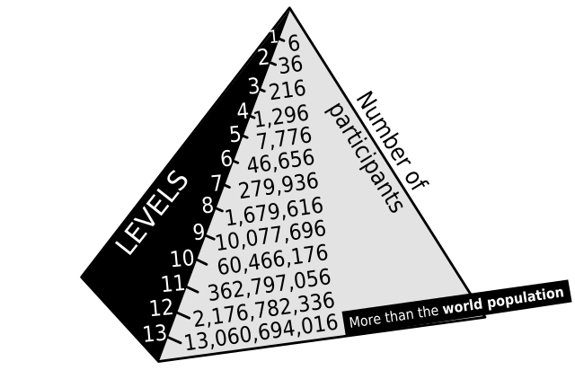

# De fascinerende wereld van piramidespelen

> Piramide schema, beeld van [Wikipedia](https://commons.wikimedia.org/wiki/File:Pyramid_scheme_diagram.svg)

Het doel van dit artikel is inzicht te geven in de financiele
en psychologische werking van Ponzischema's en piramidespelen,
inclusief wat simpele handvatten om slachtoffers te helpen.

- [Het artikel](paginas/artikel.md)
- [Over de auteur](paginas/over_de_auteur.md)
- [Mini samenvatting](paginas/mini_samenvatting.md)
- [Definities](paginas/definities.md)
- [Hoe herken je een piramideschema?](paginas/herkennen.md)
- [Dankwoord](paginas/dankwoord.md)
- [Kopieerrecht](paginas/kopieerrecht.md)
