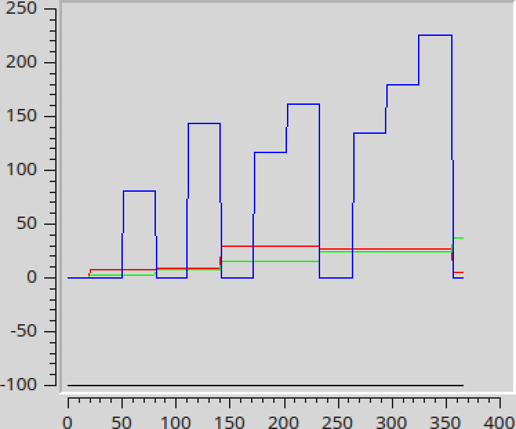
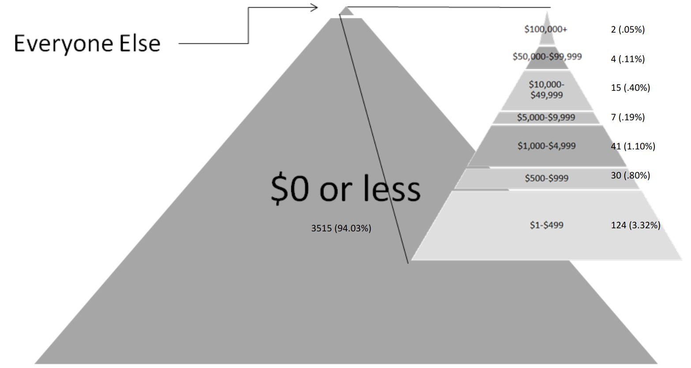

# De fascinerende wereld van piramidespelen

## Aanleiding

'Grijp je kans nu!', 'Wordt rijk in een maand!':
allemaal hebben we wel eens een soortgelijke advertentie gezien.
De meeste van ons zullen -terecht!- gedacht hebben dat de belofte
te mooi is om waar te zijn.
Hierdoor missen we echter de kans om een kijkje te nemen in de
-in mijn ogen, facinerende!- wereld van de Ponzischema's en piramidespelen,
inclusief de trieste werkelijkheid voor de slachtoffers.
Met dit artikel hoop ik de inzichten -en fascinatie- te delen,
inclusief advies hoe met slachtoffers om te gaan.

## Ponzi schema

Een Ponzi schema is een financiele afspraak tussen twee personen
met beloften die niet waargemaakt kunnen worden.
Sterker nog: het breken van deze financiele beloften is ingebouwd in de opzet.
Deze opzet is -onder andere- uitgevonden door de Italiaanse zwendelaar
Charles Ponzi.
Ik zal toelichten hoe een Ponzi schema werkt, eerste vanuit de ogen
van een slachtoffer, dan uit de ogen van de dader.

Het verhaal van een slachtoffer van een Ponzi schema
begint met het vernemen van een advertentie,
bijvoorbeeld 'Investeer in bedrijf X [A]: verdubbel uw geld in
een jaar!'.
Slachtoffers zullen ongelovig zijn en in het begin geen of
weinig geld storten op de bankrekening van bedrijf X. Echter, na een
tijd blijkt dat de -veel kleine!- bedragen inderdaad
verdubbeld uitgekeerd worden.
De aanvankelijk ongelovige slachtoffers zijn verrast en delen dit gevoel
met hun kenissen en ditmaals worden er grotere bedragen 'geinvesteerd'.
Een jaar later, echter, als de slachtoffers hun verdubbelde geld opvragen,
is bedrijf X failliet en de slachtoffers zullen
hun geld waarschijnlijk niet terug krijgen.

Het verhaal van de zwendelaar van een Ponzi schema
begint met een voldoende hoeveelheid geld om de eerste
uitbetalingen te kunnen doen.
Na een advertentie komt het eerste geld binnen
en een jaar later worden de eerste
uitbetalingen gedaan, van veelal kleine bedragen.
Door deze uitbetalingen storten de slachtoffers nu veel meer geld
op de bankrekening van bedrijf X, zegge 20,000 euro.
Omdat dit bedrag niet verdubbeld uitbetaalt kan worden,
wordt er een faillisement gepland na -zegge- 11 maanden.
Voordat het zover is worden de 20,000 euro overgemaakt
naar geheime bankrekeningen van de zwendelaar.
De zwendelaar gaat failliet, kan niet aan de schulden voldoen
en wordt deze kwijtgescholden.

## Hoe herken je een Ponzischema?

Een Ponzischema is te herkennen aan een combinatie van eigenschappen.
Het is altijd een combinatie van meerdere
factoren, dus één eigenschap is niet genoeg om een bedrijf een Ponzischema te
noemen. Hier enkele kenmerken van een Ponzischema,
vertaald van `[Bosley & McKeage, 2015]`.

Een Ponzischema belooft een uitzonderlijk hoge winst in een te korte periode,
gemakkelijk geld en/of een passief inkomen: beloftes kosten het bedrijf
namelijk niks (ze worden immers niet waargemaakt) en leveren misschien
wel meer geld op voor de fraudeur.
Als het bedrijf in een product handelt (en dat is handig,
want dat maakt het bedrijf legitiemer)
dan is dit product vaak onbewezen en/of oneerlijk geprijst.
Er is geen geschreven informatie over de (productie)kosten
van dit product en de verkoopcijfers van het product
zijn geheim, vaag en/of oncontroleerbaar.
Er is geen duidelijk beleid om geld terug te vragen in geschreven vorm.
In tijden van een recessie kan een Ponzischema prima groeien
en deelnemers komen vooral uit economisch zwakkere regios

## Piramidespel

> Logo van het piramidespel Fortune Hi-Tech Marketing,
> van [Wikipedia](https://en.wikipedia.org/wiki/File:Fortune_Hi-Tech_Marketing_-logo.gif)

Een piramidespel is een combinatie van een Ponzischema en multilevel marketing,
waarin slachtoffers geld verdienen door nieuwe slachtoffers voor het
Ponzischema te werven.

Voor een deelnemer van een piramidespel gelden dzelfde
[JMB: VERBETEREN]
hetzelfde als van een Ponzi schema,
XXXXXXXXXXXXXXXXXXX
maar er is meer: het slachtoffer wordt nu ook gevraagd om
nieuwe leden te werven. Ook heeft het slachtoffer nu iemand boven zich
in een hierarchie, vaak met onschuldige namen als 'mentor' of 'coach',
die het slachtoffer motiveert om nieuwe slachtoffers te werven.
Het werven van nieuwe slachtoffers levert geld, status
en nieuwe 'investeringsmogelijkheden' met nog sterkere beloftes.

Het verhaal van de zwendelaar van een piramidespel is
hetzelfde als van een Ponzi schema,
maar er is meer:
er is nu een groep slachtoffers die actief nieuwe slachtoffers werft.
Deze groep moet gemotiveerd blijven.
Dit kan gebeuren door bevoorbeeld de beste slachtofferwervers
te belonen met exclusieve (en zichtbare!) beloningen en evenementen.

## Hoe herken je een piramidespel?

Een piramidespel is te herkennen aan een combinatie van eigenschappen,
waaronder alle eigenschappen van een Ponzischema,
zoals hierboven beschreven. Deze aanvullende eigenschappen
zijn ook vertaald van `[Bosley & McKeage, 2015]`.

In een piramidespel moet een nieuwe deelnemer geld inleggen om mee te mogen
doen. Als er een produkt wordt verkocht, dan is het verplicht dit produkt
te kopen en/of per termijn meer van dit produkt te moeten kopen.
Er is weinig/geen bewijs dat het produkt aan niet-deelnemers wordt verkocht,
omdat een Ponzischema  vooral inkomsten haalt uit de nieuwe leden.

Deelnemers zien interne presentaties die focussen op het werven van nieuwe
leden (in plaats van bijvoorbeeld produktkennis) en het piramidespel
heeft een complexe beloningsstructuur.

In het begin van de historie van een piramidespel is er een
exponentiele groei in het aantal slachtoffers.
Later, als de meeste deelnemers geld verliezen, is de doorstroom hoog.
In de slotfase is er een snelle neergang in het aantal deelnemers.
Er lopen rechtzaken tegen het bedrijf en er
zijn klachten van slachtoffers over het piramidespel
in andere regios of eerdere verschijningsvormen.

> Simulatie van geldstromen binnen een piramidespel van een slachtoffer,
> met de tijd (in dagen) op de horizontale as en (beloofde) bedragen
> op de vertical as.
> De zwarte lijn geeft het effect op de bankrekening van een slachtoffer,
> in dit geval 100 euro schuld, ten gevolge van de inleg van 100 euro.
> De rode, groene en blauwe lijnen geven de *beloofde* waarde aan
> van de drie typen portefeuilles.
> Merk vooral de blauwe lijn op: deze wekt de suggestie
> dat het slachtoffer winst heeft gemaakt.
> In deze simulatie heeft het slachtoffer geen geld opgenomen.
> De simulatie is gebaseerd op een -nu failliet- piramidespel.

## Waarom gaan mensen bij een piramidespel?

XXXXXXXXXXXXXXXXXXXXXXXXX
De belangrijkste reden dat mensen bij een piramidespel gaan,
is wegens 'representativeness bias'
`[Hidajat et al., 2020][Wilkins et al, 2012]`.

Voor dit vooroordeel is een bekende nodig,
wiens lidmaatschap als (onjuist) bewijs dient het piramidespel legitiem is.

XXXXXXXXXXXXXXXXXXXX
Bovenstaand vooroordeel is belangrijkste voorspellen
voor het inleggen van geld in een piramidespelen.
Volgens een studie verklaart 'representativeness bias' 47% van de variatie.
De rest is the verklaren uit
'confirmation bias' (dwz vooral naar bewijs luisteren
die de eigen opvatting bevestigd) (22%),
zelfoverschatting (15%),
'framing bias' (dwz een beslissing nemen op basis
van enkel positieve informatie)
(11%) en optimisme (9%) (merk op: deze getallen samen
komen boven de 100% uit, onduidelijk is waarom) `[Hidajat et al., 2020]`.

## Waarom zitten mensen in een piramidespel?

Meedoen aan een piramidespel is om meerdere redenen aantrekkelijk:
ten eerste is er is de belofte van financieel gewin en
ten tweede is er een gemeenschap waar iedereen welkom is,
waar hard werken wordt beloond, waar je vrienden kan maken.

De belofte van financieel gewin is aantrekkelijk
en tot op zekere hoogte waar:
uit onderzoek blijkt dat -als je de vrijwillig gewerkte uren niet meeneemt-
dat ongeveer 2% quitte speelt
en dat ongeveer 4% winst maakt `[Bosley & McKeage, 2015]`.
Zie onderstaande figuur
voor de verdeling van inkomsten over percentage slachtoffers.

> Figuur uit `[Bosley & McKeage, 2015]` die de inkosten (in USD)
> laat zien per percentage slachtoffers. Merk op dat de inleg voor
> dit piramidel 300 USD was en dat geinvesteerde tijd niet is meegenomen
> in de berekening.

Het percentage van slachtoffers dat winst maakt varieert
per piramidespel: een andere studie vond dat 11,8%
van de slachtoffers winst maakt.
Deze winst is meestal laag: 50% van deze winst kwam
in de handen kwam van de top 0,1% `[Tyler et al., 2023]`,

De sociale gemeenschap achter een piramidespel is voor sommige interessant:
hard werken wordt beloond, men begeleid elkaar, men motiveert elkaar,
men maakt nieuwe vrienden.
Dit sociale aspect zorgt ervoor dat slachtoffers hun 'bedrijf'
minder kritisch bekijken, omdat een inzicht dat het 'bedrijf'
nep is leidt tot verlies van al deze vriendschappen.

## Wat kun je doen met slachtoffers?

Het heeft net zoveel nut slachtoffers
te overtuigen met rationele argumenten
als het geval is bij andere illusies zoals religie.
Aangeraden wordt vooral te blijven luisteren naar het slachtoffer
en een open dialoog te behouden:
stel open en onbedreigende vragen,
met de hoop dat het slachtoffer zelf ooit het gewenste inzicht verkrijgt.

Als het Ponzischema of piramidespel failliet gaat,
help het slachtoffer bij zijn/haar schaamte.
Zeg nooit 'Ik zei het toch!'.

## Conclusie

Ponzischema's en piramidespelen zitten slim in elkaar!

Mensen die kritisch genoeg zijn,
zullen minder vaak in de valse beloften geloven.
Sommigen zullen eenmalig geld verliezen, schouders ophalen,
wonden likken en verder gaan.
Grotere slachtoffers zijn hen die grote sommen geld hebben ingelegd
en verloren.
Dit is reden dat ponzischema's en piramidespelen illegaal zijn:
omdat de beloften onjuist zijn.
Daarom zijn ponzischema's en piramidespelen (anoniem)
te melden bij de Financiele Opsporingsdienst, `https://www.fiod.nl/`.

De grootste slachtoffers zijn de mensen die *denken* winst te maken:
zij zitten vast in een prettig sociaal netwerk van 'mede-investeerders'.
Dit netwerk voelt de kloof tussen 'binnen' en 'buiten',
tussen de gelovigen en ongelovigen.
[JMB: Meer nadruk]
Het sociale leven (familie en vrienden) buiten het netwerk
van de slachtoffers komt onder
de druk te staan.

Ik hoop dat dit artikel u een duidelijke inzicht heeft gegeven in de financiele
en psychologische werking van Ponzischema's en piramidespelen,
inclusief wat simpele handvatten om slachtoffers te helpen.

## Voetnoten

* [A] Met de 'x' in 'bedrijf X' wordt de wiskundige 'x' bedoelt, in
   de zin van 'een bedrijf met een bepaalde naam'.
   Fout is te denken dat dit gaat over
   het bedrijf met de naam 'X', dat voormalig de naam 'Twitter' droeg

## Referenties

<!-- markdownlint-disable MD013 -->

* `[Bosley & McKeage, 2015]` Bosley, Stacie, and Kim K. McKeage. "Multilevel Marketing Diffusion and the Risk of Pyramid Scheme Activity: The Case of Fortune Hi-Tech Marketing in Montana." American Marketing Association, 2015.
* `[Hidajat et al., 2020]` Hidajat, Taofik, et al. "Why are people trapped in Ponzi and pyramid schemes?." Journal of Financial Crime 28.1 (2020): 187-203.
* `[Tyler et al., 2023]` Kell, Tyler, et al. "Forsage: Anatomy of a smart-contract pyramid scheme." International Conference on Financial Cryptography and Data Security. Cham: Springer Nature Switzerland, 2023.
* `[Wilkins et al, 2012]` Wilkins, Anne M., William W. Acuff, and Dana R. Hermanson. "Understanding a ponzi scheme: Victims’ perspectives." Journal of Forensic & Investigative Accounting 4.1 (2012): 1-19.

<!-- markdownlint-enable MD013 -->
